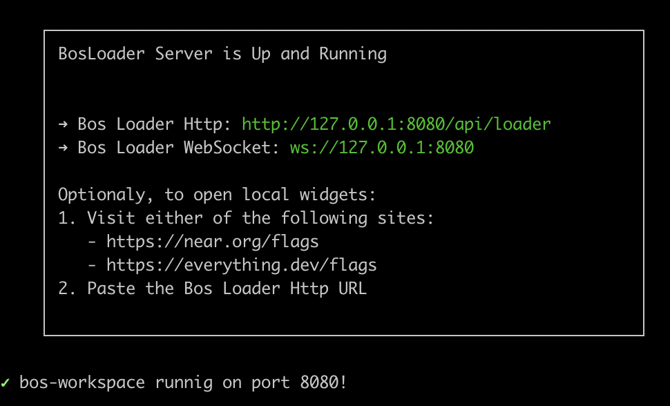

# NEAR <> Urbit Playground

This repository is set up with a clone of the [NearSocial/VM](https://github.com/NearSocial/VM), a simplified clone of [near-everything/viewer](https://github.com/near-everything/viewer) gateway ([everything.dev](https://everything.dev)), and a [bos-workspace](https://github.com/nearbuilders/bos-workspace).

### Breakdown

- /VM - exposes a VM element `Urbit` for integrating with the [Urbit Http-API](https://developers.urbit.org/guides/additional/http-api-guide)
- /gateway - runs a local React App configured with the VM for displaying widgets served from /apps
- /apps - widgets to be served by bos-workspace, displayed on the gateway. The root account is "urbit.near" as configured in apps/urbit/bos.config.json. Nested paths in /widget will resolve to dot notation (e.g. urbit.near/widget/page.home). Your gateway will redirect references to prioritize the widgets from local.

## Getting Started

To run locally:

1. From this root (/near), run:
```cmd
pnpm install
pnpm run dev
```

This will serve your local widget code (/apps/urbit/*) to port 8080.



and start a react app at port 4000.

2. Configure flags on gateway to work with local widgets. Go to `http://localhost:3000/flags` and paste in: `http://127.0.0.1:8080/api/loader`. Components should be loading successfully if localhost:3000 shows a dashboard rather than a white screen.


3. Verify VM is connected


This signifies that `Urbit` keyword is recognized.

5. After making any changes to the VM, rebuild.

```cmd
cd VM
pnpm run build
```

If linked successfully, gateway should load changes automatically.
